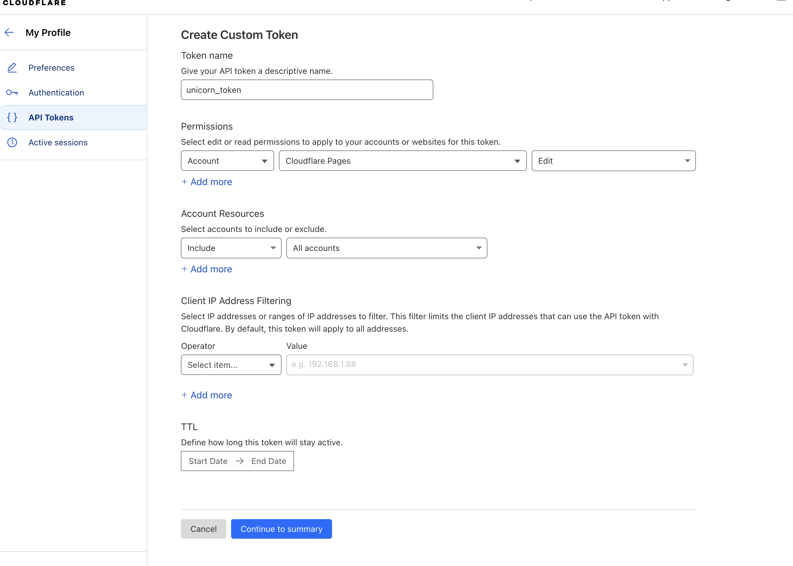

# Unicorn

Unicorn is a monorepo to make it easier to deploy websites alongside your job applications allowing you to customize your pages and content to the specific job opportunity. Unicorn provides a GitHub Action that will deploy your sites as Cloudflare Pages.

Now go show your prospective employers what a special unicorn you are.

To use this monorepo, you'll need a Cloudflare account.

## Running A Site

After creating a repo from the template, `cd` into your project directory and run

```bash
npm install
```

This repo uses npm workspaces, so to run a specific site, run:

```bash
npm run dev -w ./sites/unicorn-demo
```

where `unicorn-demo` is the name of the site you're targeting.

## Deployment Instructions

### Create A Cloudflare API Key

1. In your Cloudflare account, navigate to "Profile" -> "API Tokens" -> "Create Token"
2. Under the "Custom token" section, click to create a custom token. Give the token a name and the edit permission to Cloudflare Pages. It should look something like this:



### Add GitHub Secrets / Creating Your First Site

1. Copy the token from the previous step and add it as a GitHub secret called `DEPLOY_TOKEN` in your repo.
2. Navigate to the "Workers & Pages" tab. Here you should find your account id. Copy that and add it to your repo as a secret called `CLOUDFLARE_ACCOUNT_ID`.
3. While here, create your first site. Select "create application". Select "Pages" tab. Select "Create using direct upload". Select "Upload assets", although we will be skipping the actual upload of assets (the GH action workflow will do this for us, we just need to create the pages "project" at this point). Give the project a name, and select "Create project" without uploading assets. Take note of the project name you provided. We will use this within the [GitHub action](./.github/workflows/publish.yml#L14).

## Thanks

This project is a minimal fork off of the [Typography](https://github.com/Moeyua/astro-theme-typography) by [Moeyua](https://github.com/Moeyua). Thanks for the design Moeyua!
