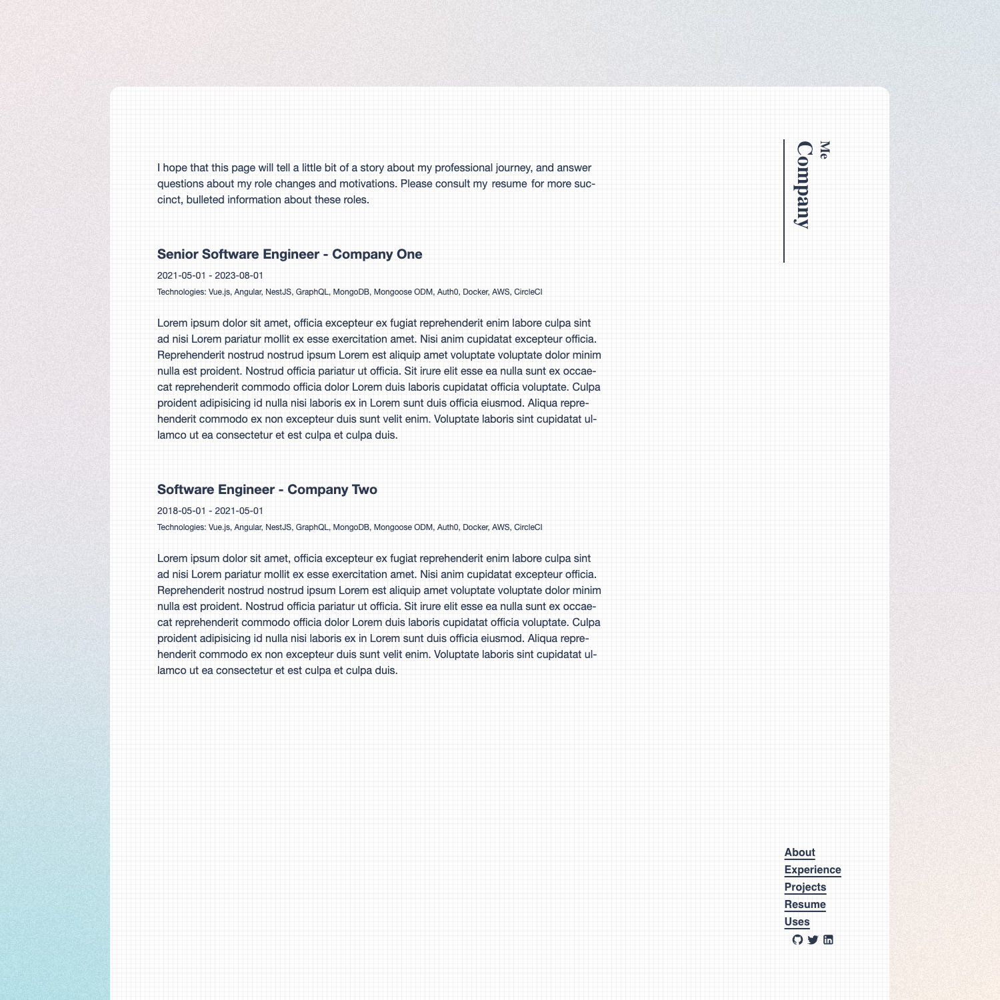

# Unicorn

<p align="center">
  
</p>

<h6 align="center">
    <a href="https://unicorn-demo.pages.dev/">Live Demo</a>
</h6>
<h5 align='center'>
    <b>This work is rewrite from <a href="https://github.com/moeyua/astro-theme-typography/">Typography</a></b>
</h5>

Unicorn is a monorepo to make it easier to deploy websites alongside your job applications allowing you to customize your pages and content to the specific job opportunity. Unicorn provides a GitHub Action that will deploy your sites as Cloudflare Pages.

Now go show your prospective employers what a special unicorn you are.

To use this monorepo, you'll need a Cloudflare account.

## Installation

To use this monorepo, click "use this template" in the upper right corner of GitHub.

## Usage

### Running A Site

After creating a repo from the template, `cd` into your project directory and run

```bash
npm install
```

This repo uses npm workspaces, so to run a specific site, run:

```bash
npm run dev -w ./sites/unicorn-demo
```

where `unicorn-demo` is the name of the site you're targeting.

### Adding A Site

There is a utility script for doing most of the work for creating a new website. It can be found and edited at `/scripts/new_site.mjs`. It is designed for my own use but is heavily commented and should be able to be adapted for your use if needed. Run the script with:

```bash
npm run new -- --dir google -c Google -j "Senior Software Engineer (Fullstack)"
```

- Where --dir is the name of the directory where the project will live in the monorepo. The script will copy the template directory into the directory that you pass in here.
- And -c is the company name of the company you're applying to. The script will find and replace references to "Company", a generic placeholder that the template project uses, to the value you pass in here.
- and where -j is the job title you are applying for. The script will find and replace references to "Job Title", a generic placeholder that the template project uses, to the value you pass in here.

Taking all this in mind, it will make sense to customize the template project with your copy to minimize the amount of work needed after creating a new site. Just make sure to either adopt these conventions when copywriting or refactor the script to suit your needs.

If needed, consult the CLI help docs with:

```bash
npm run new -- --help
```

After you've run the script, be sure to follow the instructions at the end of the CLI. Notably, ensure adding your project to Cloudflare Pages and adding the site configuration entry in `sites.json`. For these entries, the key should be the name of the package in the repo (the directory name of the site). The value should be the name of the project within Cloudflare Pages. For example, given a site living at `sites/my-site` and a corresponding Cloudflare Pages project given the name `my-cf-site`, the corresponding entry should be:

```json
{
  "my-site": "my-cf-site"
}
```

## Deployment

Additional notes / instructions can be found in [this blog post](https://blog.waysoftware.dev/blog/unicorn/)

### Create A Cloudflare API Key

1. In your Cloudflare account, navigate to "Profile" -> "API Tokens" -> "Create Token"
2. Under the "Custom token" section, click to create a custom token. Give the token a name and the edit permission to Cloudflare Pages. It should look something like this:


### Add GitHub Secrets / Creating Your First Site

1. Copy the token from the previous step and add it as a GitHub secret called `DEPLOY_TOKEN` in your repo.
2. Navigate to the "Workers & Pages" tab. Here you should find your account id. Copy that and add it to your repo as a secret called `CLOUDFLARE_ACCOUNT_ID`.
3. While here, create your first site. Select "create application". Select "Pages" tab. Select "Create using direct upload". Select "Upload assets", although we will be skipping the actual upload of assets (the GH action workflow will do this for us, we just need to create the pages "project" at this point). Give the project a name, and select "Create project" without uploading assets. Take note of the project name you provided. Update the [GitHub action](./.github/workflows/publish.yml#L14) with this value.

## Upstream Changes

Occasionally, this project may get updated. If you want to receive these changes, please create an upstream remote origin pointing to this template and merge changes as needed.

```bash
git remote add template https://github.com/johnmcguin/unicorn.git
git fetch --all
git merge template/main --allow-unrelated-histories
```

## Thanks

This project is a minimal fork off of the [Typography](https://github.com/Moeyua/astro-theme-typography) by [Moeyua](https://github.com/Moeyua).
